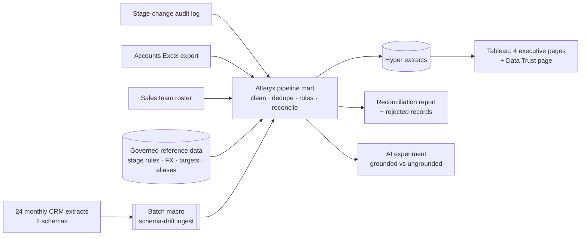

# Sales Pipeline Intelligence — Alteryx + Tableau + AI
### Turning a messy European CRM into trusted executive decisions, and proving why AI needs business logic

<!-- TODO (final): add hero image images/linkedin/hero.png -->

   

> **In one sentence:** I built a governed data-prep layer in Alteryx that cleans and reconciles 24 months of
> messy CRM exports for a (fictional) European IT consultancy, delivered four executive dashboards in Tableau,
> and ran an experiment showing that an AI assistant answers pipeline questions wrongly on raw data but
> correctly once grounded in my business definitions.

---

## 1. The business problem
Nexora Consulting sells Cloud, Data & AI, Cybersecurity and ERP services across 18 European countries.
Its Chief Revenue Officer asks four questions every week:

1. Will we hit next quarter's number, and how healthy is the pipeline?
2. Where are deals getting stuck, and how much money is at risk?
3. Which managers and departments convert pipeline into revenue?
4. Where in Europe should we invest next?

The CRM can't answer them reliably: a migration changed its schema mid-year, the same stage is spelled
29 ways, 45 clients exist twice, amounts arrive in 8 currencies, and reps type their own win probabilities.

## 2. Why this can't be solved by "just asking AI"
<!-- TODO (final): 2–3 sentences + the results table from ai_experiment/README.md -->
Modern AI is great at calculating, but it doesn't know *our* rules: which records are duplicates, which
exchange rate Finance uses, that we forecast with governed probabilities, or what counts as a "stuck" deal.
Those rules are business logic, and business logic has to be defined, agreed, and proven.
**That's the layer this project builds.** See [`docs/business_definitions.md`](docs/business_definitions.md).

| Question | Ground truth | AI on raw data | AI grounded in my definitions |
|---|---|---|---|
| Unique opportunities | 4,800 | *TBD* | *TBD* |
| Open pipeline (EUR) | *TBD* | *TBD* | *TBD* |
| Win rate, last 12 months | *TBD* | *TBD* | *TBD* |

## 3. Architecture


## 4. Data prep in Alteryx
<!-- TODO (final): screenshots 08_alteryx_full_workflow.png, 02_batch_macro_inside.png, 05_join_unmatched_owners.png -->

| Problem in the raw data | How I solved it | Alteryx skill |
|---|---|---|
| CRM migration changed column names in July 2025 | Batch macro reads each file and renames columns from IT's mapping table | Batch macro, Dynamic Rename, Control Parameter |
| Same deal exported several times | Remove exact duplicates, keep latest version by last-modified | Unique, Sort |
| 29 spellings of 6 stages, 59 of 18 countries | One governed alias table, maintained as data | Find Replace |
| 45 duplicate client accounts | Normalised name key (case, spaces, legal suffix) → master account | Formula (REGEX), Summarize, Join |
| Owners typed as names, "Last, First", initials | Three-pass matching, unmatched records inspected at every step | Join (L/R outputs) |
| No "days in stage" in the CRM | Rebuilt stage stints from the audit log | Multi-Row Formula (grouped) |
| 8 currencies | FX at close month (won/lost) or snapshot month (open) | Join, Formula |
| "Can I trust it?" | Automated checks against CRM control totals; workflow fails if any check fails | Test, Message, Summarize |

**Reconciliation:** <!-- TODO (final): table from data/output/quality/dq_reconciliation.csv --> 5,012 raw rows → 4,800 opportunities, every step explained.

## 5. Tableau dashboards
<!-- TODO (final): one screenshot + 2 insight bullets per page -->
### Pipeline Health & Forecast
### Deal Velocity & Stuck Deals
### Manager & Department Performance
### Europe Market Opportunity
### Data Trust

## 6. Key insights
<!-- TODO (final): 4–5 bullets written from your dashboards -->

## 7. Repository structure
```
├── data/
│   ├── raw/                  # messy CRM exports (synthetic)
│   ├── reference/            # governed business rules & finance tables
│   └── output/               # Hyper extracts, reconciliation, AI inputs
├── alteryx/                  # workflows and macros
├── tableau/                  # packaged workbook (.twbx)
├── docs/                     # plan, checklist, business definitions
├── ai_experiment/            # protocol and results
├── images/                   # screenshots
└── scripts/                  # synthetic data generator (Python)
```

## 8. How to reproduce
1. (Optional) Regenerate the data: `python scripts/generate_raw_data.py` (seeded, so results are identical).
2. Open `alteryx/01_ingest_crm_extracts.yxmd`, then `alteryx/02_build_pipeline_mart.yxmd`, and run both.
3. Open `tableau/Nexora_Pipeline_Intelligence.twbx` in Tableau Desktop (the free edition works).

## 9. Skills demonstrated
**Data preparation:** schema-drift handling, deduplication, entity resolution, date and currency normalisation, audit-log modelling ·
**Data quality:** reconciliation to source control totals, automated tests, rejected-record audit trail ·
**Business analysis:** metric definition, forecasting logic, sales operations domain ·
**Visualisation:** executive dashboard design, LOD expressions, maps, actions ·
**AI:** grounding, evaluation against ground truth, human verification.

## 10. About
<!-- TODO: your name, one line about you, LinkedIn link -->
*All companies, people and figures are fictional and were generated for learning purposes.*
